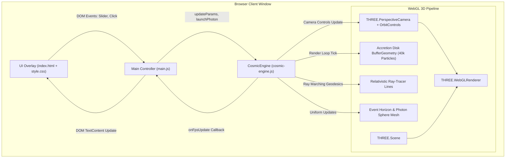

# Project Architecture Blueprint: Cosmic Canvas

## 1. Architectural Overview & System Style
Cosmic Canvas is a **Client-Side Event-Driven Single-Page Architecture** with high-performance WebGL graphics rendering pipelines.

### Guiding Architectural Principles
- **Zero-Latency GPU Pipeline**: Direct WebGL BufferGeometry & GLSL Shaders without Virtual DOM reconciliation layers.
- **Unidirectional Event Flow**: DOM UI inputs dispatch directly to the `CosmicEngine` orchestrator, which updates simulation uniforms and particle buffers before the next `requestAnimationFrame` tick.
- **Separation of Concerns**: UI styling (Vanilla CSS glassmorphism) is completely decoupled from WebGL compute and rendering.

---

## 2. Architecture Diagram (C4 Component Model)

---

## 3. Core Subsystems & Responsibilities

### A. Main Orchestrator (`main.js`)
- Binds DOM event listeners (Sliders: `mass`, `spin`, `lensing`, `tilt`; Buttons: `btn-reset`, `btn-supermassive`, `btn-photon`).
- Subscribes to `engine.onFpsUpdate` and dynamically updates the header badge.

### B. WebGL Engine & Physics Pipeline (`cosmic-engine.js`)
- **Lifecycle Management**: Scene initialization, camera configuration, canvas resizing, rendering loop.
- **Physics Equations**:
  - Keplerian Velocity: $\omega(r) = 1.8 \cdot \sqrt{M} \cdot \text{spin} \cdot r^{-1.5}$
  - Relativistic Doppler Shift: $v_x = -p_z \cdot \omega \implies \text{HSL Hue Shift}$
  - Geodesic Ray-Tracing: $a(r) = (2.5 \cdot M \cdot \text{lensing}) / r^3$ towards origin.
- **Memory & Resource Management**: Automatic disposal of line geometries and materials for expired photon rays after 4.0s.

### C. Design & Presentation Layer (`index.html`, `style.css`)
- Glassmorphism tokens (`backdrop-filter: blur(16px)`).
- Semantic DOM containers with isolated z-index stacking (`#canvas-container`: `z-index: 1`, Controls: `z-index: 10`).

---

## 4. Extension & Evolution Guide

### Adding New Celestial Physics Simulators (e.g., Wormholes, Binary Pulsars)
1. **Extend Engine**: Create a dedicated factory method in `cosmic-engine.js` (e.g., `createWormholeBridge()`).
2. **Expose Uniforms**: Add interactive state fields to `this.params` and propagate inside `updateParams()`.
3. **Bind UI Control**: Add range inputs in `index.html` and wire input listeners in `main.js`.
4. **Update Specs**: Document the feature in `prds/` and update `CONTEXT.md`.

---

## 5. Architectural Invariants
- 1. Maintain 60 FPS under standard browser GPU load.
- 2. No runtime JavaScript framework dependencies (keep zero-bundle overhead).
- 3. All time-dependent animations must use `clock.getDelta()` rather than fixed frame steps.
